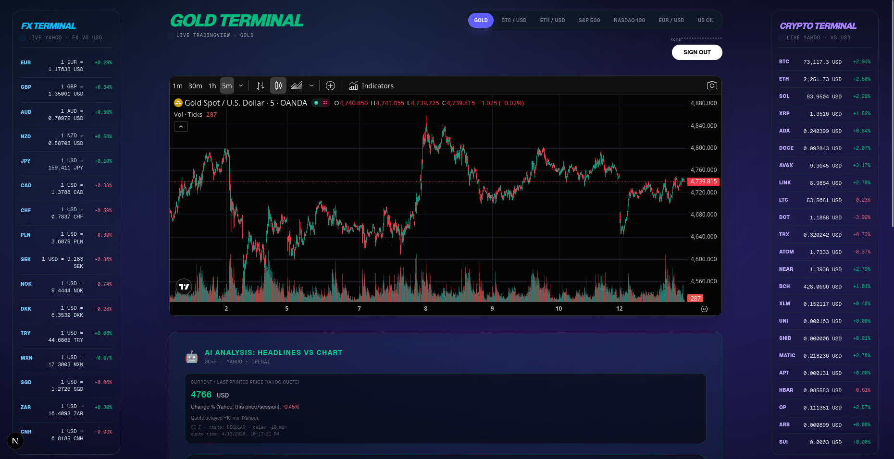
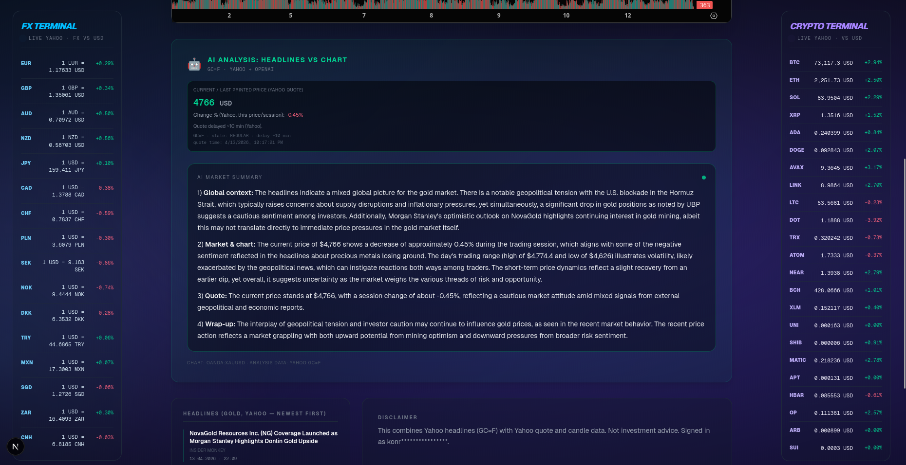
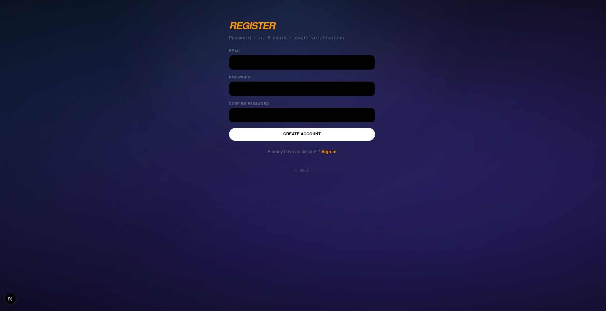

# Stock Monitor AI

Interactive market dashboard that combines live charts, headline feeds, and AI-generated market context in one place.

## Why this project

`Stock Monitor AI` is built to quickly answer one practical question:
"What is happening on this market right now and how do recent headlines match the current price action?"

The app pulls market data and news, then generates a compact AI summary for logged-in users.

## Key features

- Live chart view (TradingView widget) for selected markets
- Fast market switching (gold, silver, BTC, ETH)
- Headline feed per market (Yahoo Finance source)
- AI analysis block (news + quote context) for authenticated users
- Side terminals for FX and crypto tickers vs USD
- Email/password auth flow with verification support

## Tech stack

- Next.js 16 (App Router)
- React 19 + TypeScript
- NextAuth.js
- Prisma ORM
- SQLite (local default) / configurable `DATABASE_URL`
- OpenAI API (analysis)
- Yahoo Finance API wrapper
- Tailwind CSS 4

## Screenshots

Add your app screenshots to `docs/screenshots/` and they will render in this section automatically once committed.





Suggested captures:
- Main dashboard with chart + side terminals
- AI analysis card after login
- Register or login screen

## Quick start

1) Install dependencies:

```bash
npm install
```

2) Create env file:

```bash
cp environment.example .env.local
```

3) Run Prisma migration (if needed):

```bash
npx prisma migrate dev
```

4) Start development server:

```bash
npm run dev
```

Open `http://localhost:3000`.

## Environment variables

Use `environment.example` as the source of truth.

Most important variables:
- `DATABASE_URL`
- `NEXTAUTH_SECRET`
- `NEXTAUTH_URL`
- `RESEND_API_KEY` (optional for production email sending)
- `OPENAI_API_KEY`

## NPM scripts

- `npm run dev` - run development server
- `npm run build` - build production bundle
- `npm run start` - start production server
- `npm run lint` - run ESLint

## Notes

- Local secret files (for example `.env.local`) are ignored by git.
- AI output is informational only and not investment advice.
